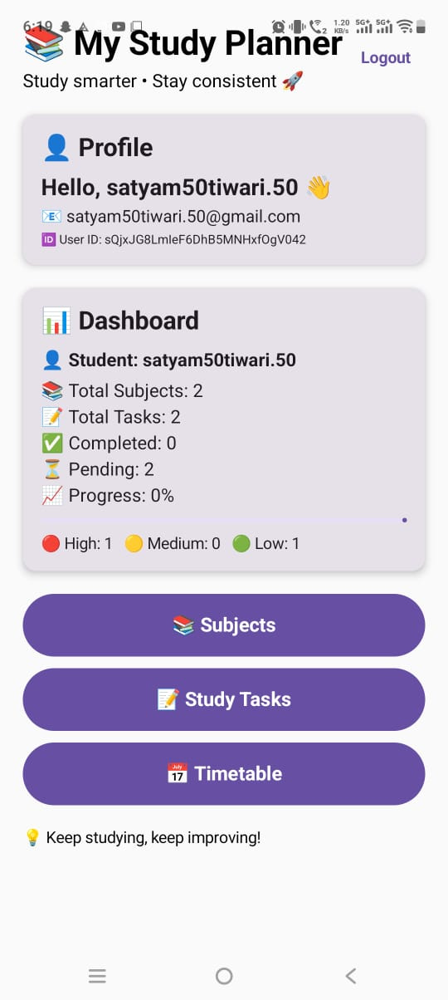

# 📚 My Study Planner

My Study Planner is a simple and useful study planning application designed to help students organize their daily study activities and manage their learning goals.

## 🚀 Features

- 📅 Create and manage study plans
- 📝 Organize study tasks
- ⏰ Plan your study schedule
- 📊 Track your study progress
- 🎯 Manage learning goals
- 📱 Android application

## 📱 Download

Download the latest APK:

👉 [Download My Study Planner APK](https://github.com/satyamtiwari9719/My-Study-Planner/raw/refs/heads/main/app-debug.apk)

## 🛠️ Technologies Used

- Python
- Streamlit
- Android
- GitHub

## 📥 Installation

1. Download the APK from the link above.
2. Open the downloaded APK on your Android phone.
3. Allow installation from unknown sources if Android asks.
4. Install the application.
5. Open **My Study Planner** and start planning your studies.

## 📸 Screenshots

## 👨‍💻 Developer

**Satyam Tiwari**

GitHub:  
https://github.com/satyamtiwari9719

---

⭐ If you find this project useful, consider giving it a star!
